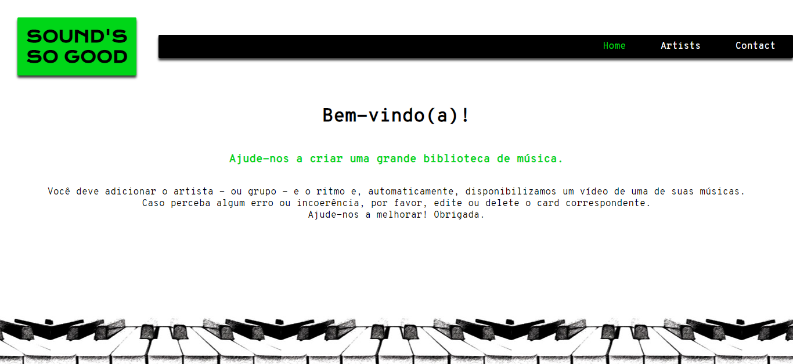

# Sounds so Good
An API management to create an artist's library.

## Motivation
It was an extra exercise of Laboratoria's bootcamp specialization in React. The requirement was to create a SPA (Single Page Application), where you can login, post and delete elements of an API. 

## Appearance

## Technology Stack
+ HTML5
+ CSS3
+ JavaScript 
+ React
+ Local Storage
+ [Pede Toca API](https://peaceful-badlands-98440.herokuapp.com/api-docs/) 

## Oficial Roadmap

#### version 2.0.0 (scheduled for December 2018)
+ Allow the insertion of songs of each artist and their execution;
+ Allow cards edition;
+ Code refactoring.

#### version 1.0.0 (released)
+ The user can login or register. You can insert new artists and delete existing cards.

